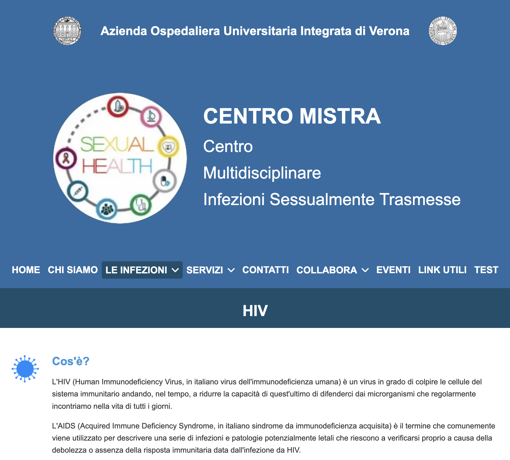
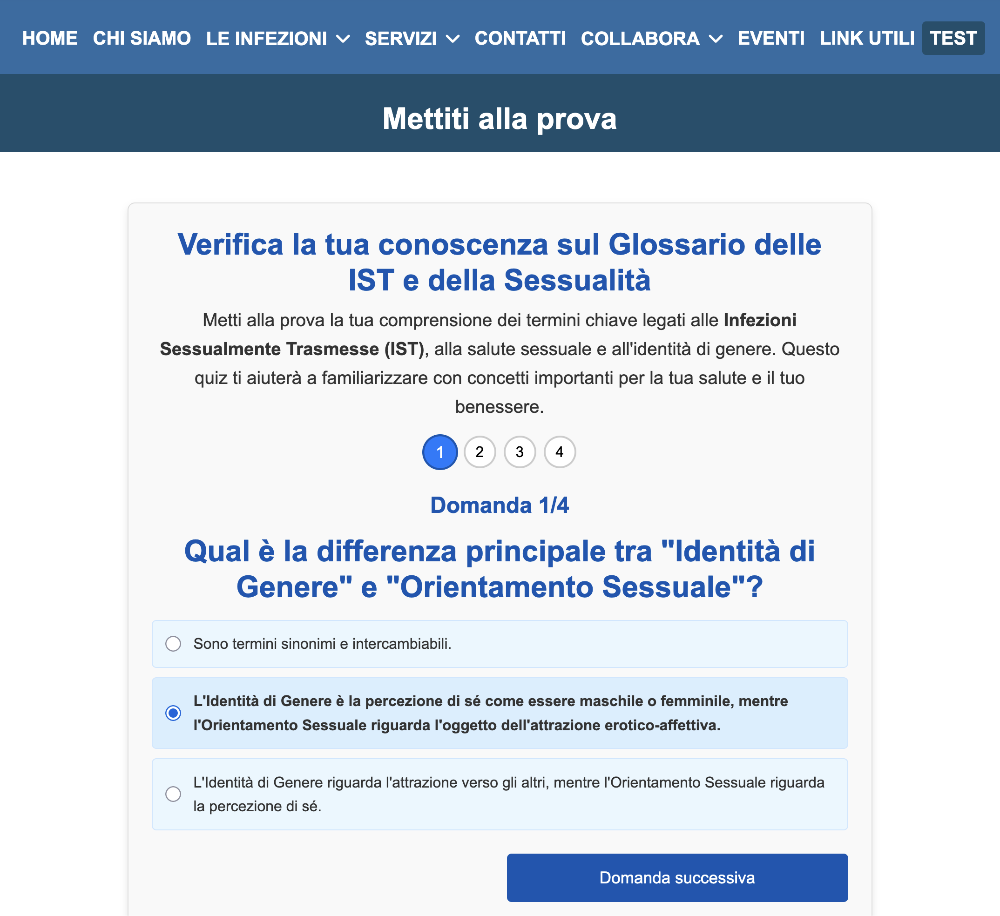
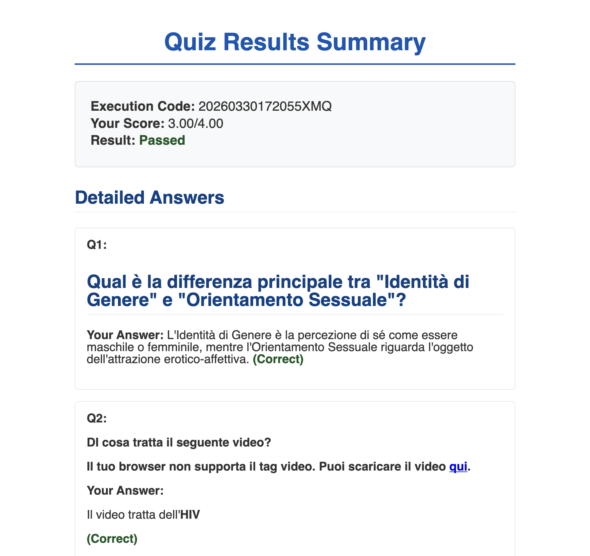

# MISTRA CMS + Quiz Plugin

Django CMS web application for Centro MISTRA that publishes sexual health content and runs interactive quizzes with stored results and PDF export.

## Authors
- Simone Xiao
- Edoardo Bazzotti

## Overview
This project combines a content-managed website (Django CMS) with a custom quiz plugin implemented as a separate Django app (`quiz_plugin`). The quiz workflow selects a random test, serves randomized questions and answers via API endpoints, stores user executions (age, sex, duration, score) in SQLite, and generates a downloadable PDF summary using WeasyPrint. Based on the included report, it was developed in the academic context of the 2024-2025 "Applicazioni Dinamiche per il Web" project.

## Context: Centro MISTRA
The platform was developed for Centro MISTRA, a public health initiative of the Azienda Ospedaliera Universitaria Integrata di Verona focused on STI prevention, diagnosis, and education.
The site combines informational sections with interactive self-assessment quizzes in a single CMS-driven workflow.

## Tech Stack
- Python 3
- Django 3.1
- Django CMS 3.8 ecosystem (`django-cms`, `djangocms-*` plugins)
- SQLite (`project.db`)
- Vanilla JavaScript, HTML, CSS
- Bootstrap 5 and Font Awesome (loaded via CDN in templates)
- WeasyPrint (PDF generation)
- Pillow, django-filer, easy-thumbnails (media handling)

## Key Concepts
- CMS-driven architecture with reusable placeholders/templates and a custom Django CMS plugin.
- REST-style backend design for quiz data loading, submission, and PDF generation.
- Client-side quiz state management (navigation, progress indicators, answer persistence, completion checks).
- Relational modeling of assessments and analytics (`Test`, `Question`, `Answer`, `TestExecution`, `GivenAnswer`) with admin-side review metadata.

## System Features
### For General Users
- Browse CMS-managed informational pages and prevention resources.
- Complete anonymous STI-related quizzes.
- Receive immediate score feedback and download a PDF summary of results.

### For Doctors / Administrators
- Access Django CMS and Django admin with role-based content management workflows.
- Create and edit pages using CMS plugin blocks (text, media, and embedded content).
- Manage quiz configuration (tests, questions, answers, categories, and related metadata).
- Review completed test executions and add medical notes through the admin interface.

## Screenshots
### Infections Information Page

### Quiz Interface

### Quiz Results

### PDF Results Export

## Custom Quiz Plugin Admin Models
- `Categories`: taxonomy used to group quiz questions by topic.
- `Questions`: question bank entries with HTML text and linked answer options.
- `Sex Options`: selectable demographic options used in the quiz start form.
- `Test Executions`: per-user attempt records (time, score, duration, selected test, and review notes).
- `Tests`: quiz definitions that combine multiple questions and set a minimum passing score.

## Accessibility and Validation
- The project report documents WCAG 2.1 (Level AA) validation as part of development.
- Manual checks include keyboard-only navigation, zoom readability, and contrast verification.
- Automated checks were performed with Lighthouse and Axe DevTools.

## How to Run
1. Create and activate a virtual environment:
	- macOS/Linux: `python3 -m venv .venv && source .venv/bin/activate`
2. Install dependencies: `pip install -r requirements.txt`
3. Create a `.env` file in the project root with required variables:
	- `SECRET_KEY='<generate-a-key>'`
	- `DEBUG=False`
	- `ALLOWED_HOSTS=localhost,127.0.0.1`
	- Optional key generation command: `python3 -c "from django.core.management.utils import get_random_secret_key; print(get_random_secret_key())"`
4. Apply migrations: `python manage.py migrate`
5. Start the server: `python manage.py runserver`
6. Open: `http://127.0.0.1:8000/it/`

Note: this repository includes a pre-populated `project.db` with sample CMS pages and quiz content. Run migrations and start the server to see the app immediately without manual setup.

## Academic Context
Built as part of Applicazioni Dinamiche per il Web at the University of Verona, MSc Computer Science and Engineering.

